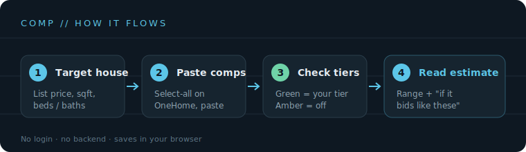
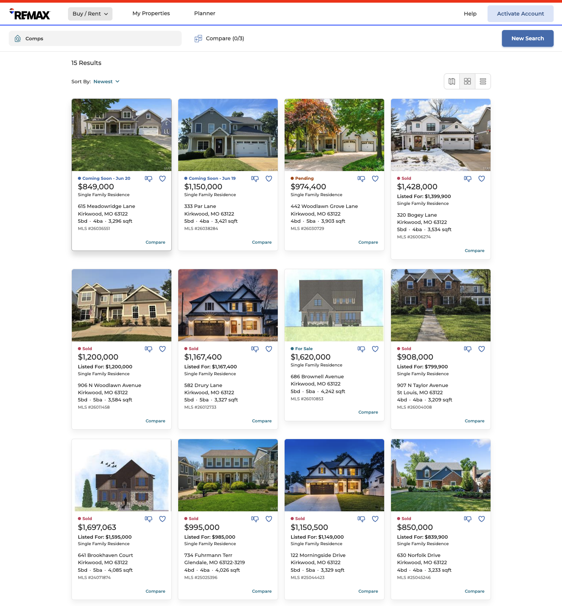
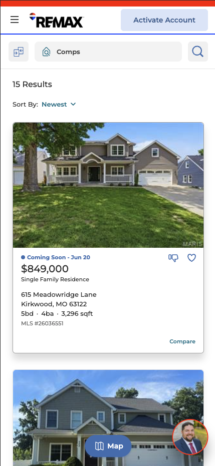

# Comp// — How to use it

Figure out what a house will *actually sell for* by reading the sold comps, not the list price. Paste comps straight from OneHome, let them sort into condition tiers, and get a price range plus an "if it bids like these" number. No login, no backend — it all runs in your browser.

---

## 1. Enter the house you want

At the top, fill in the target house: list price (or the "coming soon" price), square footage, and beds / baths.

As soon as price and sqft are in, you'll see a line like **`List $/sqft: $258`**. That's just list ÷ sqft, and it's the benchmark the app uses to decide which condition tier your house belongs to. It updates live as you type.

---

## 2. Grab the comps from OneHome

You don't need to carefully avoid the photos — **select everything, and the app throws away the junk** (buttons, image captions, "Compare" links). Pasting into a plain-text box drops all images automatically.

### On desktop

Your OneHome comps page looks like this:

Click anywhere in the comps list, press `Ctrl + A` (Windows) or `Cmd + A` (Mac) to select all, then `Ctrl/Cmd + C` to copy.

### On mobile

Same list, one card per column:

Long-press a listing, drag the selection handles to cover as many cards as you can, tap **Select All** if it appears, then **Copy**. Don't fight to exclude images — they won't survive the paste anyway. You can also work in batches: paste a few, hit *Read pasted comps*, repeat. The app appends new comps and removes duplicates.

**Easiest of all:** copy from the exported PDF instead of the live page — PDF text selects clean, especially on a phone.

### Paste it in

Drop the whole block into the box and tap **Read pasted comps**. You'll get a confirmation like *"Added 11 comps (11 sold, 4 listed-only)."* Missing one, or have an odd format? Use **Add one by hand** below the box.

---

## 3. Check the condition tiers

This is the brains of it. Kirkwood homes split hard by condition, not location — sold prices ran from about $239 to $415 per square foot. That spread is renovation level: older/updated homes versus new-builds and gut-renovations.

The app sorts your comps into two bands and decides which one your house belongs to:

- **Green is your tier.** Checked by default. These feed the estimate.
- **Amber is the higher tier.** Unchecked by default — renovated / new-build comps that would wrongly inflate your number.

It's a default, not a verdict. Tap any checkbox to override. Toured the house and it's nicer than the listing let on? Check a higher-tier comp to test it. A green comp is much bigger than your target (say 4,200 sqft)? Uncheck it to pull the high end down.

The number on the right of each comp is its **$/sqft**; the small `+13% vs list` under the address is how far over asking it closed.

---

## 4. Read the estimate

Three things to look at:

- **Comp range** — the low-to-high band by square footage.
- **Comp midpoint** — the big number; the middle of your chosen comps.
- **If it bids like these** — applies how hard these homes bid over list at closing. In a hot market this can sit well above the midpoint, and that's your signal to plan to compete above ask.

The sentence underneath translates it into plain English ("plan to compete above the $849,000 ask," and so on).

---

## Saving and sharing

- **Save** (in the estimate card) names a run and files it on the **Saved estimates** shelf. Load or delete any of them later. Saves live in this browser on this device.
- **Copy share link** packs the whole run — target, comps, and your tier choices — into a link. Text it to someone and it opens pre-loaded with your exact analysis; they can tweak from there. Nothing is uploaded; the data rides in the link itself.
- **Export as text** copies a plain-text summary to your clipboard (or downloads a `.txt`) as a portable backup.
- **Clear current** wipes the working target and comps. Your saved estimates are kept.

---

## Good to know

- **Is my data private?** Everything stays in your browser. The site is public, but nothing you type is uploaded anywhere.
- **Will my phone and laptop share saves?** No — saves are per-device (that's the trade for free, no backend). Use the share link to hand a run between devices.
- **Pure comps.** The estimate reads tiers and over-list behavior. It can't see a specific house's lot, finishes, or things like railroad-track proximity — that judgment stays with you.

---

*Built as a single static `index.html` — see the project README for GitHub Pages deploy steps.*
